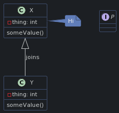

# PlantUML Animo Themes

This repository is a work in progress and contains themes based off the Animo Branding Book.


## Usage
The `/themes` directory contains the themes that are available. In order to 'import' them into your diagram, you will need to use the `!includeurl <url>` command provided by PlantUML. The url passed to this command **must** be a Github Raw link. In order to get this, just navigate to the theme file you wish to import on Github, and press the 'raw' button located near the top-right of the page.

### Example usage

<div style="display: flex; flex-direction: row;">
<div style="margin: 10px">

```plantuml
@startuml

!define DARK

!includeurl https://raw.githubusercontent.com/karimStekelenburg/plantuml-theme/main/themes/animo_theme_1.puml

class User {
  name: string
  age: number
}

class Pet

Pet -up-|> User

@enduml
```

</div>

<div>

</div>
</div>

### Dark mode, light mode
All themes contain a dark and a light mode. As shown in the example above, you can chose either of them by 'defining' a boolean at the top of your diagram source. To chose the light mode, use `!define LIGHT`. For dark mode, use `!define DARK`.

> NOTE: the `!define XXXXX` statement **must** come before `!includeurl` statement, as the import statement will apply styling based on the variables that were previously defined.